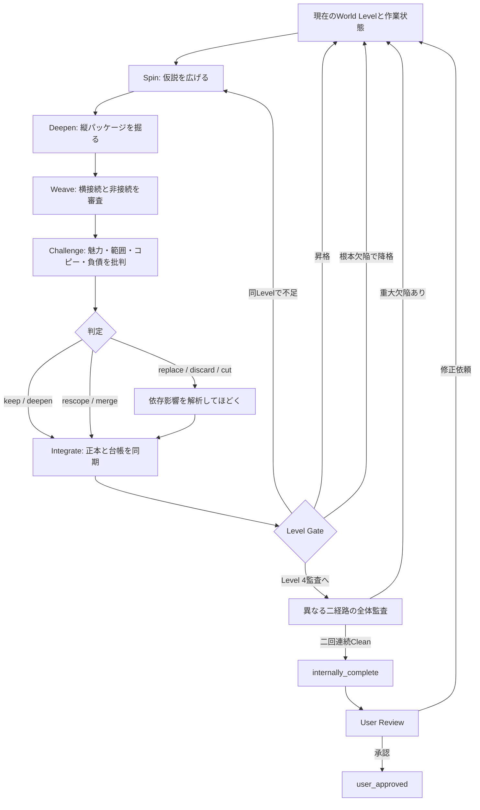

# SILK V1 世界構築仕様

この文書が製品仕様の正本です。エージェントが実際に従う詳細は`skills/silk-worldbuilder/`にあります。

要件対応は`SILK_V1_THEORY_AUDIT.md`、実証時の人間評価は`USER_EVALUATION_GUIDE.md`を参照する。

## 目的

利用者の一回の依頼を起点に、一人のAIが多数の内部反復を行い、設定を生成、深化、接続、批判、切断、置換、統合し、壮大で内部まで織り込まれた第一版世界コーパスを作ります。

一回とは一回のモデル出力ではなく、利用者がフェーズ操作を繰り返さなくてよいという意味です。

## 不変条件

- 一つの独立主題に正本ファイルは一つだけ
- 分類所属から性質を継承しない
- 仮説を審査せず正史へ入れない
- 局所主張を審査せず世界法則へ昇格しない
- 接続数を品質指標にしない
- 関係には理由、範囲、実際の影響を要求する
- 接続しないことも世界の輪郭として守る
- 生成量を理由に弱い設定を保護しない
- 王道や単純さを新奇性不足だけで棄却しない
- ユーザー未承認の生成物を`approved`へ入れない
- 文字数、ファイル数、反復数、自己採点を完成条件にしない
- 世界観構築を章、主人公、クエスト、結末へ移行させない
- 中断を完成扱いせず、状態から再開する

## 世界モデル

世界は、分類別文書の集合ではありません。

```text
正本主題
  神、国家、龍、季節、法、人格化された遺物、未知概念など

縦糸
  一つの主題の成立、構造、変化、現在、制約、影響

横糸
  主題同士を変化させる、審査済みの関係

境界
  接続しない理由、非存在範囲、影響しない場所、独立因果
```

一つの主題に正本ファイルは一つだけです。起源、現在状態、能力、制約、歴史、解釈、主要関係は、その正本だけで概要を理解できる形にまとめます。

別ファイルへ分割できるのは、その事件、仕組み、思想などが独立した同一性を持ち、複数主題へ影響する場合です。分割後も元の正本へ要約と関係を残します。

## 分類

分類は可変の閲覧ビューです。分類から性質を継承しません。

同じ`artifacts`に入っていても、人格、所有者、稼働状態、複製可能性、歴史は個別に決めます。同じ`creatures`に入っていても、世界規模の分布、繁殖、生態、敵対性を共有しません。

分類変更や状態移動で同一性が壊れないよう、関係はファイルパスではなく安定IDを参照します。

## 承認

開発状態、SILK内部の暫定採用、ユーザー承認を分離します。

- `subjects/pending/`: 作業中、内部採用済み、未レビュー、修正依頼済み
- `subjects/approved/`: ユーザー承認済み、またはユーザー固定正史
- `subjects/discarded/`: 内部棄却またはユーザー棄却

自律生成の終了状態は`internally_complete`です。ユーザーが全体または指定範囲を確認した後だけ`user_approved`になります。

## 世界成熟度

- Level 0: 起点。意図、境界、仮説、最初の圧力を決める。
- Level 1: 骨格。荷重を支える主題と独立因果を選ぶ。
- Level 2: 体系。重要主題を縦パッケージで芯まで掘る。
- Level 3: 世界網。縦糸を横につなぎ、誤接続を切る。
- Level 4: 球体。複数の時間、場所、社会層、視点、縮尺から世界が成立する。

各Levelで`Spin -> Deepen -> Weave -> Challenge -> Integrate`を繰り返します。回数では昇格しません。後から根本欠陥が判明した場合は主題または世界を降格させます。



## 想発

可能性は広く、正史採用は狭くします。

新しい空白に対して、既存法則の継承、変質、独立原因、反証、非適用を検討します。全部は採用しません。一つの事例から世界法則を自動推論しません。

たとえば北方葬送術の氷が魂を保存しても、自然氷、南極、氷神、氷生物まで魂に関係するとは限りません。世界法則への昇格には、独立証拠、設計上の価値、波及先の説明責任を要求します。

## 深掘り

重要主題は、必要に応じて存在論、成立、仕組み、利用、制約、失敗、変化、制度化、日常、異論、相互作用、悪用、未解明領域まで掘ります。

魔法では属性や等級を初期値にしません。属性が実在するのか、等級が自然法則か教育制度か、神、龍、妖精、人間の現象が同じ体系かを仮説として検討します。大量利用、軍事利用、経済、治療、農業、犯罪などの破壊的な応用も監査します。

深さは見出し数ではなく、重要な問いへ具体的に答えられるかで判断します。

## 面白さと大胆な置換

面白さを新奇性と同一視しません。氷の神や龍騎士のような王道も、狙った荘厳さ、格好よさ、恐怖、美しさなどが十分に表現されていれば成立します。

一方、設定の目的、魅力、影響半径、説明負債、世界全体への占有率を厳しく見ます。修理する価値がない場合は、生成済みの量に関係なく`replace`または`discard`を選びます。

弱い設定を守るため例外や説明用歴史が連鎖する状態を救済連鎖として検出し、元の設定から置き換えます。

## 設定伝染の防止

- 同カテゴリだから同じ性質を持つ、を禁止
- 一件目を後続主題のテンプレートにしない
- 共有性質には世界内の共通原因を要求
- 世界規模の分布には拡散、繁殖、運搬、適応などの機構を要求
- 存在する場所だけでなく、意味のある非存在範囲も検討
- 名前を外して構造を比較し、偶発コピーを検出
- 差別化のためだけの機械的反転も禁止
- 一つの中心設定が全領域を説明していないか監査

## 接続

リンク数は品質指標にしません。関係には、理由、方向、範囲、両側への影響を持たせます。

同じ地域、時代、カテゴリ、属性であるだけの接続は棄却します。接続を切ることで独立性が生まれる場合は切断を優先します。将来再発しやすい誤接続は非関係台帳へ残します。

## 壮大さ

壮大さを文字数や固有名詞数で測りません。時間、空間、社会層、物質生活、制度、知識、存在論、因果、経験の複数軸を、世界に必要な比重で持たせます。

世界規模、地域、制度や生態、共同体や場所、個人や物や日常判断という複数のズームで理解できる状態を目指します。

## 完成

`subject_integrity`、`depth`、`interest`、`causality`、`weave`、`breadth`、`independence`、`anti_template`、`scope`、`naming`、`coherence`、`mystery`、`plot_boundary`、`usability`を証拠付きで監査します。

重大なキュー、未処理の置換、救済連鎖、未審査の世界法則昇格、浅い主要主題、誤接続、プロット混入が残る場合は完成できません。異なる経路による二回連続のクリーン監査を要求します。

理論上の完成と、人間が面白いと評価することは別です。V1の実証では実際の大規模世界と人間評価が必要です。
